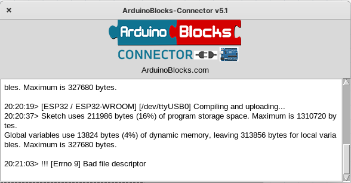
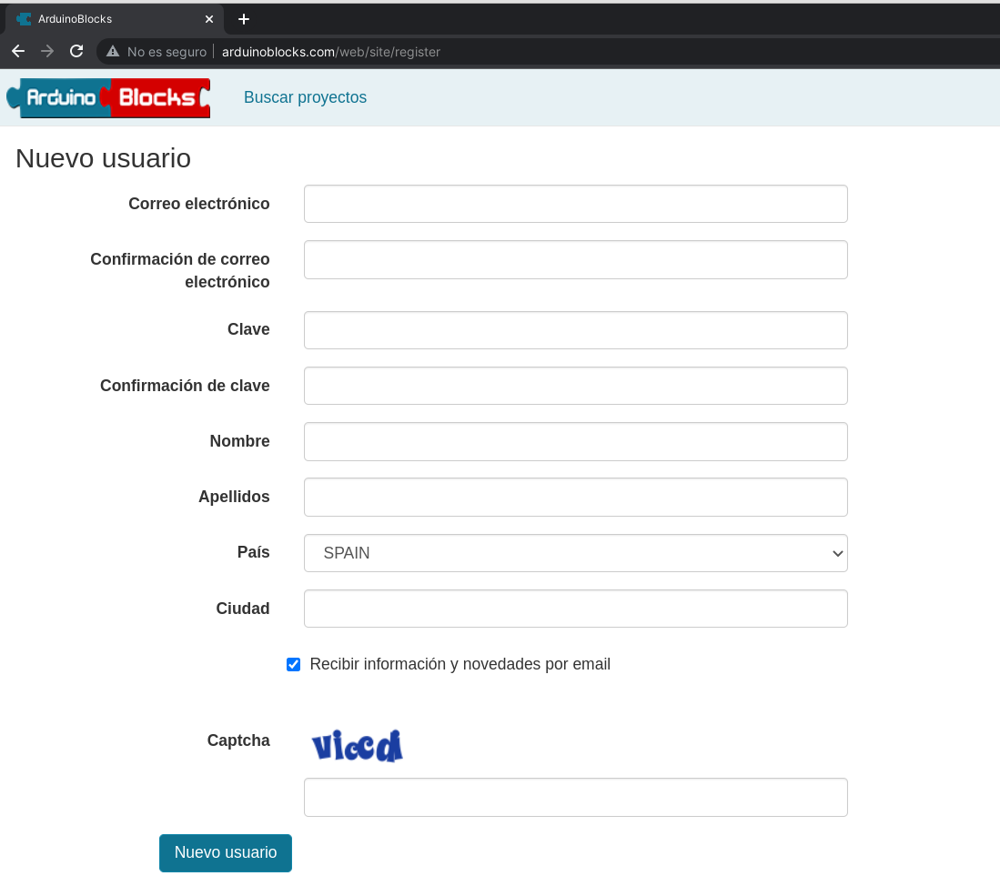
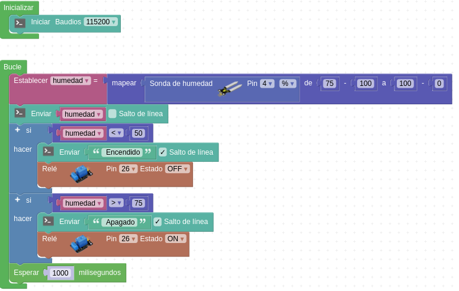

# Sistema de riego automatico


[http://bit.ly/RiegoCruzRoja](http://bit.ly/RiegoCruzRoja)

Instalacion Wemos R32 D1

[https://dl.espressif.com/dl/package_esp32_index.json](https://dl.espressif.com/dl/package_esp32_index.json)


## Hardware

ESP32 Wemos D1 R32


## Programación con bloques

### Herramientas de programación: Arduinoblocks

Comenzaremos usando [ArduinoBlocks.com](http://www.arduinoblocks.com): una herramienta de programación con bloques ideal para iniciarse.

Instalamos [ArduinoBlock Connector](http://www.arduinoblocks.com/web/site/abconnector5)



[Creamos nuestra cuenta](http://www.arduinoblocks.com/web/site/register)



## Creando proyectos

Creamos proyecto personal con la placa ESP32 STEAMakers


Documentaremos la descripción del proyecto y los componentes que vamos a usar

## LED 

Usaremos el led que incluye la placa Wemos D1 que está conectado al pin 2

No necesitamos conectar nada


[Led 2 Steamakers](http://www.arduinoblocks.com/web/project/999667)


## Controlando el brillo de un led

Vamos a controlar ahora el brillo de un led analógicamente

[led 2 PWM](http://www.arduinoblocks.com/web/project/999877)


Necesitamos:

* Wemos R32 D1
* Cable USB

### Relé


1. ¿Qué es un **relé**? un relé es un interruptor eléctrico que podemos accionar electrónicamente con una pequeña corriente y que funciona casi siempre electromecánicamente (un electroimán que atrae un contacto eléctrico) de ahí el 'clic-clic' que hacen al funcionar. 

1. Uso: los usaremos para controlar dispositivos que necesitan más potencia  que nuestra placa y/o que funcionan a mayores voltajes.
1. Control: para activar/desactivar los relés sólo tenemos que activar/desactivar el pin de nuestra placa al que está conectado
1. Alimentación y Consumo: el control de varios relés requiere de una mayor potencia de la que puede suministrar el puerto USB, por lo que usaremos un alimentación más potente si es posible.
1. Puesto que las señales de control de las placas son de 3.3V pudiera ser que algunos relés no se activen correctamente, aunque la mayoría sí. Lo que es importante es que alimentemos el relé (patilla V o Vcc) con 5V.

Conectamos el relé al pin 26


Necesitamos:

* Wemos R32 D1
* Sensor Shield
* Cable USB
* Relé


El [programa](http://www.arduinoblocks.com/web/project/1001410) será el siguiente


Activamos la consola, seleccionamos la velocidad adecuada y pulsamos "Conectar"


## Controlando relés

Una aplicación directa de lo que hemos visto activando leds, puede ser controlar un módulo con varios relés al mismo tiempo.


Como hemos dicho, un relé es un dispositivo que nos permite controlar un dispositivo conectado a la corriente con una salida de nuestro dispositivo y sus modestos 5 voltios. Es decir, el relé actúa como un interruptor electrónico y al activar la patilla que lo controla se cierra el contacto que deja pasar la corriente al dispositivo


En el montaje del ejemplo vemos como el relé 1 actúa como interruptor del circuito de alimentación de la bombilla. Al activar la salida 18, que controla el relé 1 (por estar conectada a IN1) cerrará la salida del relé y la alimentación llegará a la bombilla. Podemos poner la alimentación desde un enchufe o desde cualquier otra fuente de alimentación. Los relés funcionan como un interruptor eléctrico.


Los dos circuitos eléctricos, de alta potencia (el motor) y el de baja potencia (la placa) están aislados entre sí. No obstante **hay que tener cuidado al manejar la parte de alto voltaje/potencia**

## Sistema de riego

Versiones:

* Tiempo
* Humedad del suelo
* Humedad y lluvia


## Medida de humedad



[Proyecto](http://www.arduinoblocks.com/web/project/1001668)

Necesitamos:

* Wemos R1
* Cable USB
* Relé
* Bomba de riego
* Pila de 9v
* Sensor de humedad


## Wifi

[Proyecto wifi](http://www.arduinoblocks.com/web/project/1005666)


## Apéndice ESP32


```
CPU: Xtensa dual-core 32-bit LX6 microprocessor 160 o 240 MHz hasta 600 DMIPS
Ultra low power (ULP) co-processor
Memoria: 520 KiB SRAM
Wi-Fi: 802.11 b/g/n
Bluetooth: v4.2 BR/EDR and BLE
12-bit SAR ADC en 18 canales
2 × 8-bit DACs
10 × sensores capacitivos GPIOs
4 × SPI
2 × I²S interfaces
2 × I²C interfaces
3 × UART
SD/SDIO/CE-ATA/MMC/eMMC 
SDIO/SPI slave 
Ethernet MAC con DMA 
CAN bus 2.0
Controlador Infrarrojo (TX/RX, en 8 canales)
Motor PWM
LED PWM (up to 16 channels)
Sensor de efecto Hall 
Ultra low power analog pre-amplifier
```

[Más detalles](http://kio4.com/arduino/100_Wemos_ESP32.htm)

## Correspondencia Arduino UNO - [Wemos D1 R32](https://solectroshop.com/product-spa-1993-Wemos-D1-ESP32-R32-WROOM-32-WiFi-y-Bluetooth.html)

```
Alimentación: 5-12VDC
WiFi 802.11 b/g/n/e/i (802.11n hasta 150 Mbps)
Bluetooth v4.2 BR/EDR y BLE.
Compatible con shields de Arduino Uno.
6 Entrada analógica.
20 Entradas/Salidas digitales (3.3V) (con funciones PWM, interrupción).
Comunicación UART, SPI, I2C.
Tamaño: 68×53 mm
Conexión micro USB.
4Mbytes Flash Memoria 520Kb
Reloj: 240Mhz (un núcleo dedicado al procesaro WiFi)
Temperatura: -40C+85C
Corriente: 250mA (max)
Corriente en modo ahorro: 0.15mA
Corriente de funcionamiento: 20mA (sin WiFi)
```


Imágenes cortesía de 
[Leopoldo Armesto Ángel](https://www.slideshare.net/LeopoldoArmestongel), Lecturer at Universitat Politècnica de València (UPV)

## Configuración del IDE de Arduino

En Preferencias


Añadimos la direccion del paquete de hardware de Espressif 

```
https://dl.espressif.com/dl/package_esp32_index.json
```


Ahora en gestor de tarjetas 


buscamos **ESP32**


Y lo instalamos.

Ahora podremos seleccionar las placas de tipo **ESP32**

Aunque no viene nuestra placa, podemos seleccionar una compatible: **DOIT ESP32 DEVKIT V1**


## Driver

[Drivers para CH341 en windows](http://kio4.com/arduino/imagenes/ch341ser_win.zip)


